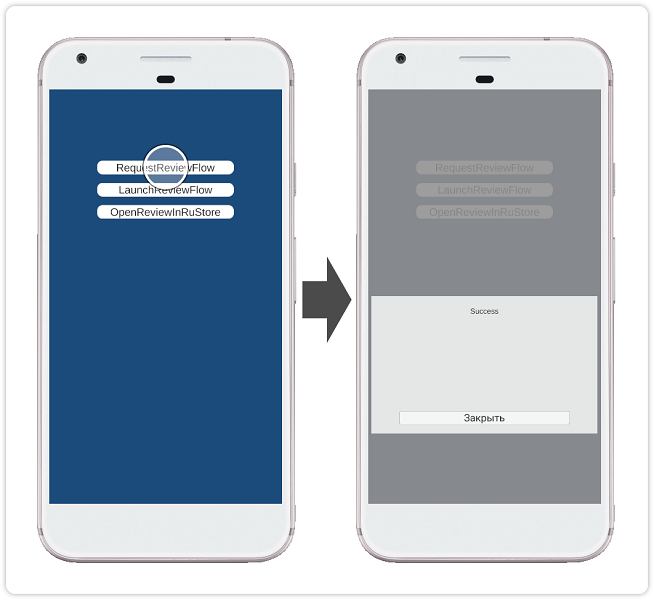
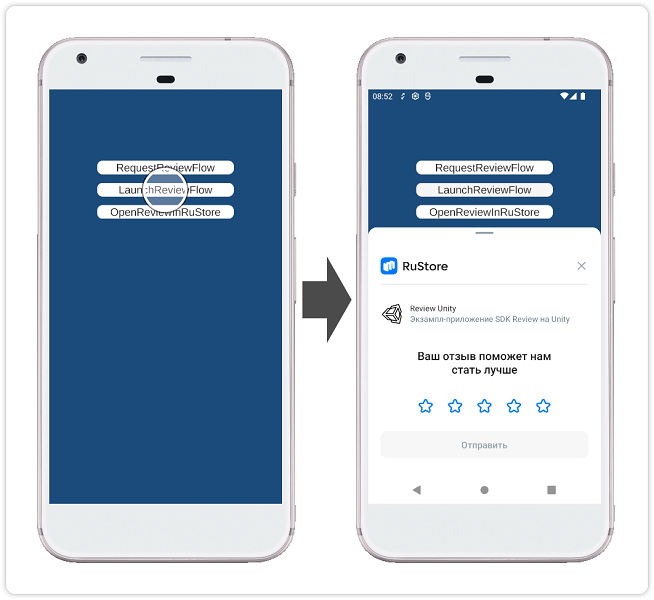

<!-- ── Language switch (EN active) ──────────────────────────────────── -->

  
    [RU][ru]
  
    EN
  

<!-- ────────────────────────────────────────────────────────────────── -->

> ⚠️ Do not use the "Code → Download" button on the GitFlic website – this method does not download files from Git LFS. [Instruction for cloning](../README_CLONE.md).

### Unity Plugin for RuStore Reviews and Ratings

#### [🔗 Developer Documentation][10]

#### SDK Requirements

To work with the reviews and ratings SDK, the following conditions must be met:

- Android OS version 7.0 or higher.
- The RuStore application is installed on the user's device.
- The RuStore version on the user's device is up to date.
- The user is authorized in RuStore.
- The application must be published in RuStore.

#### Preparing Required Parameters

Before setting up the sample application, prepare the following data.

- `applicationId` - a unique identifier of the application in the Android system in reverse domain name format (for example: ru.rustore.sdk.example).
- `*.keystore` - a key file used for [signing and authenticating an Android application](https://www.rustore.ru/help/developers/publishing-and-verifying-apps/app-publication/apk-signature/).

#### Setting Up the Sample Application

1. Open the **Unity** project from the `review_example_6000` folder.
1. Open the **ReviewSampleScene** scene from the `Assets / RuStoreReviewExample / Scenes` folder.
1. In the **Publishing Settings** section (**Edit → Project Settings → Player → Android Settings**) select **Custom Keystore** and set the parameters **Path / Password**, **Alias / Password** for the prepared `*.keystore` file.
1. In the **Other Settings** section (**Edit → Project Settings → Player → Android Settings**) configure the **Identification** section by checking the **Override Default Package Name** option and specifying the `applicationId` in the **Package Name** field.
1. Build the project using the **Build** command (**File → Build Settings**) and check the application's functionality.

#### Usage Scenario

##### Preparing to Launch App Review

Tapping the `RequestReviewFlow` button initiates the [preparation procedure for launching app review][20].

##### Launching App Review

Tapping the `LaunchReviewFlow` button initiates the [launch procedure for app review][30].

### Distribution Conditions

This software, including source codes, binary libraries, and other files, is distributed under the MIT license. Licensing information is available in the [MIT-LICENSE](../MIT-LICENSE.txt) document.

### Technical Support

Additional help and instructions are available on the page [rustore.ru/help/](https://www.rustore.ru/help/en/) and via email [support@rustore.ru](mailto:support@rustore.ru).

[10]: https://www.rustore.ru/help/en/sdk/reviews-ratings/unity/10-5-1
[20]: https://www.rustore.ru/help/en/sdk/reviews-ratings/unity/10-5-1#prestart
[30]: https://www.rustore.ru/help/en/sdk/reviews-ratings/unity/10-5-1#start

[ru]: README.md
[en]: README.en.md
